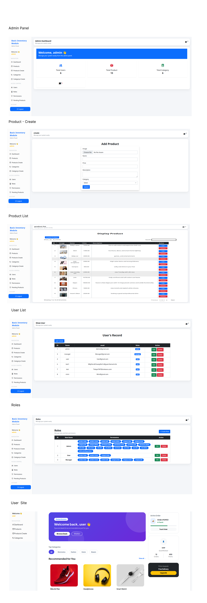

<div align="center">

# 📦 MyShop: Advanced Inventory Management System
**Secure. Scalable. Enterprise-Grade Architecture.**

[](https://laravel.com)
[](https://spatie.be/docs/laravel-permission/)
[](https://php.net)

<p align="center">
    <a href="#-key-features">Key Features</a> • 
    <a href="#-system-preview">System Preview</a> • 
    <a href="#-tech-stack">Tech Stack</a> • 
    <a href="#-installation">Installation</a>
</p>

</div>

---

## 📖 Introduction
**MyShop** is not just a basic inventory module; it is an **Enterprise-ready Workflow** designed for modern businesses. Built with Laravel 11, it features a robust product management cycle where Roles (Admin/User) determine data visibility and moderation.

---

## 📸 System Preview
*Visualizing the professional workflow from the Admin Dashboard to the public site.*

<div align="center">
  
</div>

---

## 🌟 Key Features

### 🛡️ 1. Granular Access Control (RBAC)
* **Role Management:** Implemented **Spatie Laravel-Permission** for secure Admin and User role segregation.
* **Permission Logic:** UI elements (Edit/Delete buttons) are dynamically hidden/shown using `@can` directives based on user authority.

### ⚙️ 2. Smart Approval Workflow
* **Instant Publishing:** Products created by the Admin are automatically marked as `Approved`.
* **Moderation Queue:** Products submitted by regular Users enter a `Pending` state, requiring Admin review before going live.

### 🚀 3. Optimized Performance
* **Yajra DataTables:** Integrated server-side processing for lightning-fast search and pagination, even with large datasets.
* **Eloquent Optimization:** Utilized Eager Loading to minimize database queries and prevent N+1 issues.

---

## 🛠️ Tech Stack

| Category | Technology | Purpose |
| :--- | :--- | :--- |
| **Backend** | Laravel 11 | Core Application Logic |
| **Security** | Spatie | Role & Permission Management |
| **Database** | MySQL | Relational Data Storage |
| **Frontend** | Bootstrap 5 + AJAX | Responsive UI & Asynchronous Actions |
| **Tables** | Yajra DataTables | Professional Data Handling |

---

## ⚙️ Installation & Setup

1️⃣ **Clone the Repository:**
```bash
git clone [https://github.com/mathakiyataslim/Basic-Inventory-Module.git](https://github.com/mathakiyataslim/Basic-Inventory-Module.git)
cd Basic-Inventory-Module
